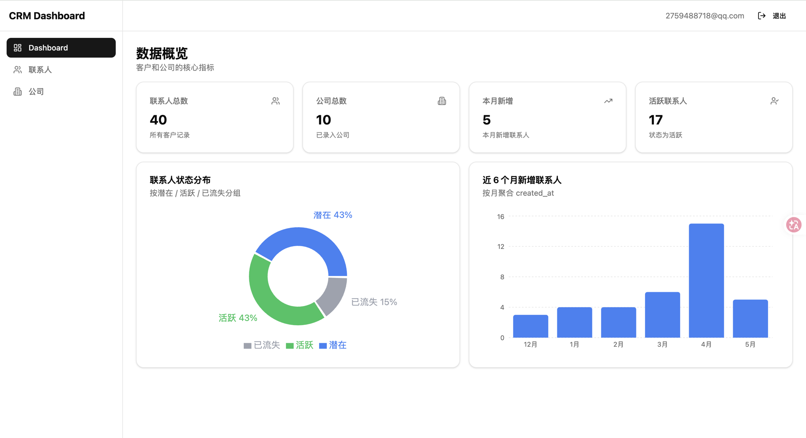
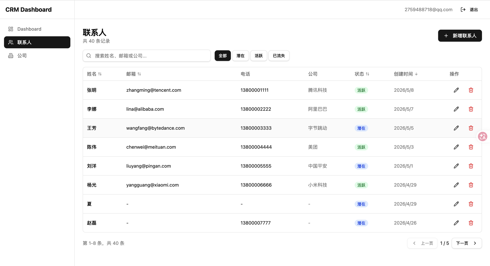
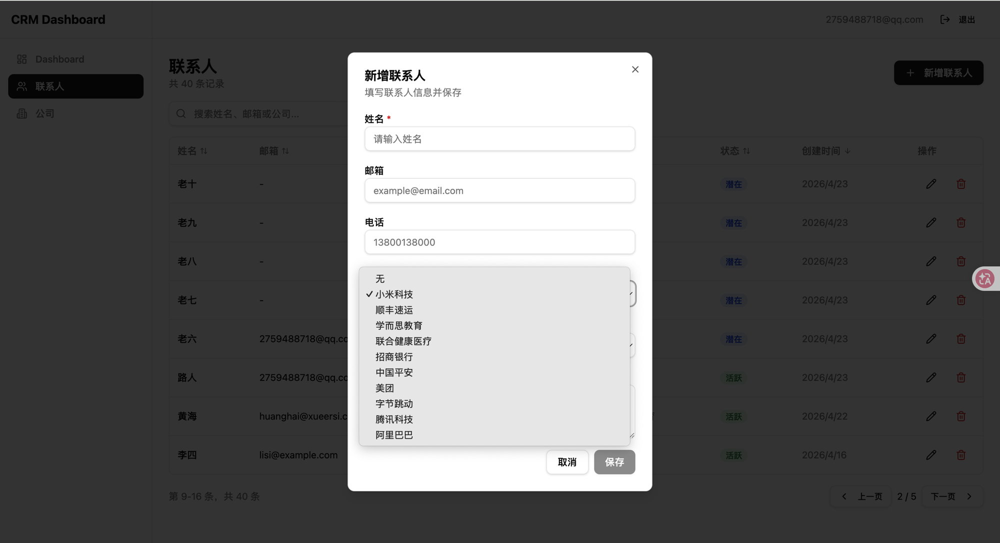
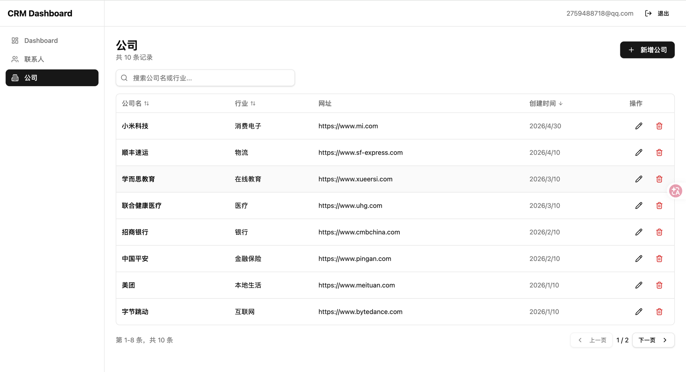

# CRM Dashboard

一个用 React + Supabase 从零搭建的客户关系管理系统，用于练习前端工程能力、丰富简历。

参考项目：[marmelab/atomic-crm](https://github.com/marmelab/atomic-crm)

## 功能预览

> 在线 Demo：<https://crm-dashboard-t8jl.vercel.app/>
>
> 登录页点 **「使用演示账号一键登录」** 即可进入塞满测试数据的 Dashboard，无需注册。
> （账号：`demo@crm-dashboard.app` / 密码：`demo12345678`）
>
> 💡 Vercel 域名国内访问偶尔受网络限制（公司/学校网络通常可达）；
> 不便访问也可以直接看下方截图了解全部功能。

### Dashboard 数据概览(统计卡片 + 状态分布饼图 + 月度趋势柱状图)


### 联系人管理(搜索 / 筛选 / 排序 / 分页)


### 关联建模(联系人 ↔ 公司)


### 公司管理(对称 CRUD 体验)

 
## 技术栈

- **前端**：React 18 + TypeScript + Vite
- **样式**：Tailwind CSS v4 + Shadcn/ui
- **图表**：Recharts
- **后端**：Supabase（Auth + PostgreSQL + RLS）
- **路由**：React Router v6
- **部署**：Vercel

## 已实现功能

- [x] 用户认证（注册 / 登录 / 登出）
- [x] 后台布局（侧边栏导航 + 顶栏 + 内容区）
- [x] 联系人列表展示（含 loading / error / empty / data 四种状态）
- [x] 行级安全（RLS）：用户只能访问自己的联系人和公司数据
- [x] 联系人搜索（按姓名 / 邮箱 / 公司关键字过滤）
- [x] 联系人状态筛选（全部 / 潜在 / 活跃 / 已流失）
- [x] 表头点击排序（升序 / 降序切换）
- [x] 联系人新增 / 编辑（表单弹窗，复用同一组件）
- [x] 联系人删除（二次确认弹窗）
- [x] 分页（客户端分页，每页 8 条；筛选/排序变化时自动回到第 1 页）
- [x] 公司管理（CRUD + 搜索 + 排序 + 分页，结构与联系人模块对称）
- [x] 联系人 ↔ 公司外键关联（下拉选择、Supabase 嵌套查询展示公司名）
- [x] Dashboard 统计卡片（联系人/公司总数、本月新增、活跃数；count-only 查询并行获取）
- [x] Dashboard 图表（状态分布饼图 + 近 6 个月新增柱状图，基于 Recharts）
- [x] 响应式布局（侧边栏在移动端折叠为抽屉、表格小屏横向滚动、卡片自适应堆叠）
- [x] 部署到 Vercel（SPA fallback 配置）

## 本地运行

```bash
# 1. 安装依赖
npm install

# 2. 配置环境变量
cp .env.local.example .env.local
# 编辑 .env.local，填入你自己的 Supabase URL 和 anon key

# 3. 在 Supabase Dashboard → SQL Editor 执行建表 SQL（已有 contacts/companies 表的话可跳过）
#    然后再执行 supabase/policies.sql 应用 RLS 策略

# 4. 启动开发服务器
npm run dev
```

## 部署到 Vercel

1. 把项目 push 到 GitHub
2. 在 Vercel 控制台 **Add New → Project**，选这个仓库 (Vercel登录记得绑定GitHub)
3. **Root Directory** 设为 `crm-dashboard`（如果仓库根不是这个项目）
4. **Environment Variables** 添加：
   - `VITE_SUPABASE_URL`
   - `VITE_SUPABASE_ANON_KEY`（在 Supabase → Project Settings → API Keys → Legacy anon API keys 里复制 `anon public` 那一行）
5. 点 **Deploy**，等十几秒拿到上线地址

`vercel.json` 已经配置了 SPA fallback——所有路径都重写到 `index.html`，刷新 `/contacts` 不会 404。

## 项目结构

```
src/
├── components/
│   ├── auth/        # 认证相关组件（ProtectedRoute）
│   ├── common/      # 通用状态组件（LoadingState、ErrorState、EmptyState）
│   ├── contacts/    # 联系人相关组件（ContactFormDialog、DeleteConfirmDialog）
│   ├── companies/   # 公司相关组件
│   ├── dashboard/   # Dashboard 相关（StatCard、StatusPieChart、MonthlyTrendBarChart）
│   ├── layout/      # 布局组件（AppLayout、Sidebar）
│   └── ui/          # Shadcn 基础组件
├── contexts/        # React Context（AuthContext）
├── hooks/           # 自定义 Hook（useContacts、useCompanies、useStats）
├── lib/             # 工具函数 + Supabase client
├── pages/           # 页面级组件
├── types/           # TypeScript 类型定义
└── App.tsx          # 路由配置（嵌套路由）

supabase/
└── policies.sql     # RLS 策略（contacts + companies 按 user_id 隔离）
```
